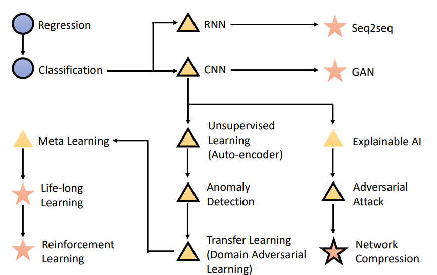

# Introduction

第一节为对各个概念的介绍，总览如下：

## 机器学习

就是寻找一个函数，让机器将输入转化为指定输出

## 机器的输出类型

**Regression:** 输出为数值

**Classification:**

- **Binary classification:** 输出为0/1 或者 yes/no

- **Multi-class Classification:** 输出为不同的类

**Generation:** 生成有结构的复杂东西(语句(RNN)、图片(GAN))

## 怎么告诉机器函数是什么样的？

**Supervised Learning:** 给训练集加lable，让机器比对函数输出结果和lable是否一致，并计算函数的loss

**Reinforcement Learning:** 通过reward来强化机器的学习

> alpha go：
>
> - Supervised Learning：把棋谱给机器看，告诉他往哪下
> - Reinforcement Learning：让机器随便下，最后对局结果(win or lose)作为reward来精进机器的技术

**Unsupervised Learning:** 对于没有lable的样本，机器能学到什么呢？

## 机器怎么找到符合要求的函数呢？

- 给机器限制函数寻找范围(linear、network architecture)
- 用learning algorithm让机器找到最好的函数(主要是Gradient Descent)

## 前沿研究

**Explainable AI:** 解释机器的判断原因

**Adversarial Attack:** 对抗攻击，对输入增加针对机器的特定干扰，从而扰乱机器的输出结果

**Network Compression:** 让network不再依赖于大设备

**Anomaly Detection:** 异常检测，当输入异常机器能发现是异常，而不会当作正常的样本去分类

**Transfer Learning(Domain Adversarial Learning):** 让机器不再强依赖于训练集，当测试集和训练集很不同，机器也能正确分类。

**Meta Learning:** 让机器学会自己学习好的learning algorithm

**Life-Long Learning:** 让机器能学习多种任务，完成多种任务